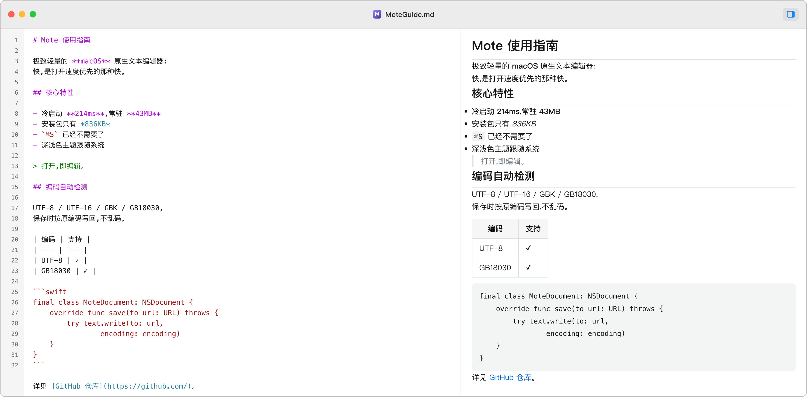

# Mote

极致的轻量 macOS 文本编辑器：打开速度优先、内存占用最低、纯原生体验，同时具备代码高亮与 Markdown / SVG 渲染预览。

<p align="center">
  <picture>
    <source media="(prefers-color-scheme: dark)" srcset="assets/screenshots/editor-dark.png">
    
  </picture>
</p>

## 特性

- **代码语法高亮**：24 种语言（23 种语言 + 纯文本兜底），基于 Sourceful 词法分析引擎，覆盖 Swift / Python / JavaScript / TypeScript / Java / Go / Rust / C / C++ / Objective-C / C# / Ruby / PHP / Shell / SQL / JSON / YAML / TOML / Markdown / HTML / XML / CSS / OCaml 等
- **Markdown 右侧分栏预览**：边输入边刷新（250ms 防抖），渲染标题、列表、表格、代码块、图片、链接、引用等基础语法，随系统深浅色自动切换
- **SVG / HTML 静态预览**：原样渲染，禁用 JavaScript（省内存、杜绝脚本注入面）
- **编码自动检测**：UTF-8（含 BOM）/ UTF-16 LE/BE（含无 BOM 启发式）/ GBK / GB18030，保存时按原编码写回
- **自动保存**：编辑后自动写回原文件，无需手动 ⌘S
- **深浅色主题**：跟随系统外观自动切换（浅色 VS Code Light+ / 深色 VS Code Dark+ 配色）
- **默认打开方式**：声明 60+ 种文本/代码文件类型，可一键设为系统默认打开程序
- **极致轻量**：冷启动 <300ms、常驻内存 <80MB、安装包 <10MB（实测达标，见[性能指标](#性能指标)）

## 技术栈

| 层面 | 方案 |
|------|------|
| 编辑区 | **100% 原生 TextKit**（`NSTextView` + `NSTextStorage`），SwiftUI 仅作承载层 |
| 高亮引擎 | Sourceful（内置 5 种 Lexer + 自定义 19 种 Lexer） |
| 预览面板 | 只读 `WKWebView`，**懒加载、按需创建、关闭即释放**，禁 JS |
| 应用骨架 | `NSDocument`（AppKit）承载 + SwiftUI 渐进引入 |
| 工程生成 | XcodeGen（`project.yml` 为唯一事实来源） |
| 最低系统 | macOS 14.0（Sonoma+） |
| 签名 | 本地 ad-hoc（无需开发者账号） |

## 架构

```
┌─────────────────────────────────────────────┐
│  NSDocument (MoteDocument)                  │
│  ├─ 读取:编码检测 → 文本                    │
│  └─ 写入:按原编码 + BOM 状态写回            │
├─────────────────────────────────────────────┤
│  EditorView (SwiftUI 承载层)                │
│  ├─ SyntaxTextView (Sourceful/TextKit)      │  ← 编辑区 100% 原生
│  └─ PreviewPanelView (WKWebView, 只读)      │  ← 按类型路由:md→Markdown, svg/html→原样
└─────────────────────────────────────────────┘
```

- 编辑区与预览面板通过文本快照 + 回调驱动，编辑时防抖（250ms）刷新预览
- 预览面板仅对可预览文档（`.md` / `.svg` / `.html` 等）创建，关闭开关即从视图层级移除并释放 WebView
- 主题由 SwiftUI `colorScheme` 环境驱动，随系统外观自动切换

## 里程碑

| 里程碑 | 内容 | 状态 |
|--------|------|------|
| M1 | 工程骨架：NSDocument 打开/保存/明文编辑 | ✅ |
| M2 | 语法高亮（Sourceful）+ 主题系统（深浅色跟随系统） | ✅ |
| M3 | Markdown 右侧分栏预览（懒加载 WebView） | ✅ |
| M4 | 打磨：SVG/HTML 预览、编码检测、自动保存、文件关联、性能达标、签名 | ✅ |

## 目录结构

```
Mote/
├── App/            # 应用入口、主菜单（⌘Z 撤销等快捷键路由）
├── Documents/      # MoteDocument:NSDocument 模型、读写、预览类型路由
├── Editor/         # 编辑区视图（TextKit + SwiftUI 桥接）
├── Highlighting/   # 语言检测、自定义 Lexer、深浅色主题
├── Preview/        # 预览面板（WKWebView）、Markdown 渲染
├── Encoding/       # 编码自动检测（UTF-8/16/GBK/GB18030）
└── Vendor/         # Sourceful 高亮引擎
docs/PRD.md         # 产品需求文档
website/            # 产品官网（纯静态，GitHub Pages 自动部署）
scripts/            # set-default-handlers.swift（设置默认打开方式）
assets/             # App 图标源（icon.svg）、备用 icns 与 README 截图（screenshots/）
project.yml         # XcodeGen 工程定义（唯一事实来源）
```

## CI / 自动化

| 工作流 | 触发条件 | 作用 |
|--------|----------|------|
| `.github/workflows/deploy-website.yml` | push 到 main 且改动 `website/` | 自动部署官网到 GitHub Pages |
| `.github/workflows/release.yml` | push `v*` 标签 | 云端构建 Release 版 Mote.app，打包发布到 GitHub Releases（产物固定名 `Mote-macOS.zip`，官网下载按钮始终指向最新版） |

> 网页部署首次启用需在仓库 Settings → Pages → Source 选择「GitHub Actions」。

## 构建

### 环境要求

- macOS 14.0+
- Xcode（含 `xcodebuild`）
- [XcodeGen](https://github.com/yonaskolb/XcodeGen)

### 构建命令

```bash
xcodegen generate   # 修改 project.yml 或新增源文件后必须执行
xcodebuild -project Mote.xcodeproj -scheme Mote -configuration Debug -derivedDataPath build build
```

产物位于 `build/Build/Products/Debug/Mote.app`。

> **注意**：新增 Swift 源文件后必须先 `xcodegen generate` 重新生成 `.xcodeproj`，禁止手工编辑 pbxproj。

### 设为默认打开方式

Mote 声明了 60+ 种文本/代码文件类型（`LSHandlerRank: Owner`）。构建并安装到 `~/Applications` 后：

```bash
# 1. 构建后拷贝到用户 Applications
cp -R build/Build/Products/Debug/Mote.app ~/Applications/

# 2. 注册到 LaunchServices
/System/Library/Frameworks/CoreServices.framework/Frameworks/LaunchServices.framework/Support/lsregister -f ~/Applications/Mote.app

# 3. 设置 Mote 为所有代码文件类型的默认打开程序
swift scripts/set-default-handlers.swift
```

已知限制：

- `.ts` 被系统识别为 MPEG 视频流，不可抢（会破坏视频文件关联）
- `html` / `md` / `plist` 若被 Chrome / Qoder / Xcode 等显式保护，需在 Finder 中右键文件 → 打开方式 → 更改全部

## 性能指标

| 指标 | 目标 | 实测 |
|------|------|------|
| 冷启动到窗口可见 | <300ms | 214ms ✅ |
| 双击文件打开到可编辑 | <500ms | 359ms ✅ |
| 常驻内存（单窗口） | <80MB | 43MB（普通）/ 60MB（md 预览）✅ |
| 安装包体积 | <10MB | 836KB ✅ |

工程手段：启动零阻塞（解析/高亮后置）、预览面板懒加载。

## License

[MIT](LICENSE)
